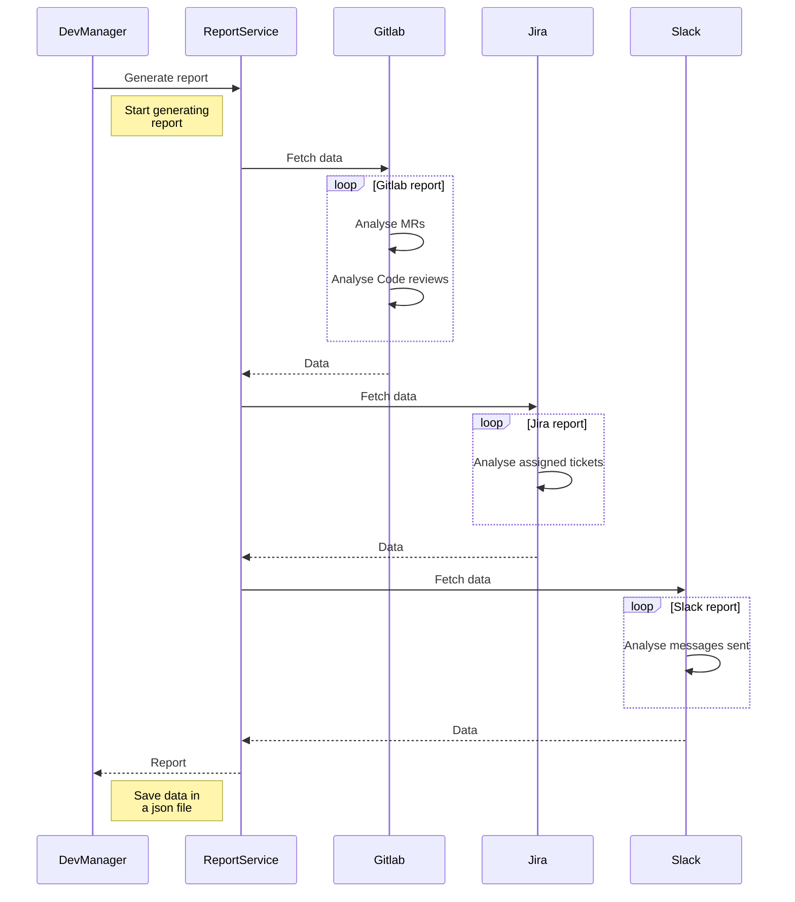
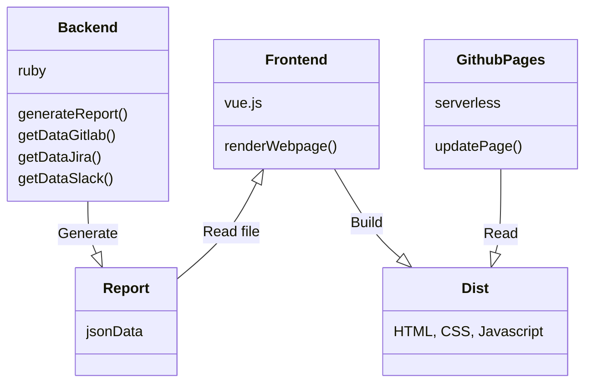
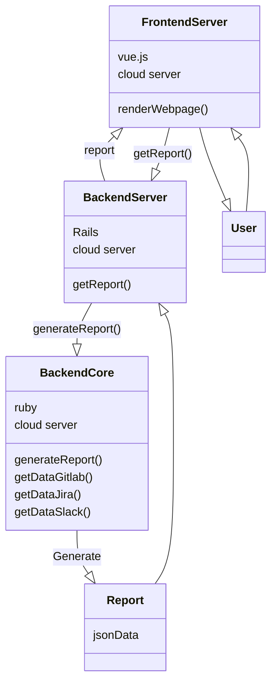

# dev-manager

[](https://github.com/ftuyama/dev-manager/actions/workflows/test.yml)

Dev manager tool to grab developer's metrics from Slack, JIRA and Gitlab

## How to use it

First, you can configure your settings by running:

```shell
make setup
```

You can generate a new report by running:

```shell
make run
```

You can visualize the web UI by running:

```shell
make web
```

## Backend Architecture



## Modules Architecture

This is the current architecture, where I generate the showcase data and webpage offline.



If it was supposed to be dynamic and handle real users, we could have this instead:


